# AWS Lambda REST API with IAM Authentication

This project demonstrates AWS Lambda REST API with IAM authentication using three different access patterns:
- **API A**: Open access (any authenticated AWS user)
- **API B**: Restricted access (only specific IAM role)
- **API C**: IAM authentication with API key for usage management

Built using:
- **Go** as the primary programming language
- **AWS SAM (Serverless Application Model)** for infrastructure as code
- **GitHub Actions** for CI/CD pipeline

## Architecture

The project implements three separate API Gateways with different access controls but identical endpoints:

### API A (Open Access)
- **Endpoints**: `/`, `/health`, `/data`
- **Access**: Any authenticated AWS user
- **Authentication**: AWS SigV4
- **Use Case**: General API access for any user in the account

### API B (Restricted Access)
- **Endpoints**: `/`, `/health`, `/data` (same as API A)
- **Access**: Only users who can assume the restricted IAM role
- **Authentication**: AWS SigV4 with restricted role assumption
- **Use Case**: Same functionality as API A but with restricted access

### API C (IAM + API Key)
- **Endpoints**: `/`, `/health`, `/data` (same as API A and B)
- **Access**: IAM authenticated users with valid API key
- **Authentication**: AWS SigV4 (for authentication) + API Key (for usage management)
- **Use Case**: Demonstrates usage management, throttling, and quotas
- **Note**: API keys are NOT for authentication - IAM provides sufficient fine-grained access control internally. API keys are for usage tracking, throttling, and quota management.

All APIs use the same Lambda function and endpoints - the only difference is the access control at the API Gateway level.

## Architecture Diagrams

### Overall System Architecture


### Authentication Flow Comparison


### IAM Access Control Patterns

```mermaid
graph LR
    subgraph "API A - Open Access"
        A1[Any AWS User] --> A2[API Gateway A]
        A2 --> A3[IAM: execute-api:Invoke]
        A3 --> A4[✅ Allow]
    end
    
    subgraph "API B - Restricted Access"
        B1[AWS User] --> B2[Assume Role]
        B2 --> B3[Restricted Role]
        B3 --> B4[API Gateway B]
        B4 --> B5[Resource Policy]
        B5 --> B6[✅ Allow Specific Role Only]
    end
    
    subgraph "API C - Usage Management"
        C1[AWS User] --> C2[API Gateway C]
        C2 --> C3[IAM: execute-api:Invoke]
        C3 --> C4[API Key Validation]
        C4 --> C5[Usage Plan Check]
        C5 --> C6[Throttling & Quotas]
        C6 --> C7[✅ Allow with Usage Tracking]
    end
    
    style A4 fill:#c8e6c9
    style B6 fill:#ffecb3
    style C7 fill:#e1bee7
```


## Development Commands

### Deployment
```bash
make deploy
```

### Testing APIs
```bash
# Test all APIs
make test-api

# Test API A (open access)
make test-api-a

# Test API B (restricted access) - shows instructions
make test-api-b

# Test API C (IAM + API key)
make test-api-c
```

### Get API URLs
```bash
# Show all API URLs
make api-url

# Show specific API URLs
make api-a-url
make api-b-url
make api-c-url

# Show API C key value
make api-c-key

# Show restricted role ARN
make role-arn
```

### Local Development
```bash
sam build
sam local start-api
sam local invoke ApiFunction
```

### Testing
```bash
go test ./...
go test -v ./...  # verbose output
```

### Build
```bash
go build ./...
sam build
```

## CI/CD Pipeline

The project uses GitHub Actions with:
- **Trigger**: Push to main branch or manual workflow dispatch
- **AWS Authentication**: OIDC with IAM role `arn:aws:iam::407461997746:role/github-actions-Role-56IHHM969DKJ`
- **Region**: eu-west-2
- **Deployment**: `make deploy` command

## Key Files to Expect

When implementing features, look for:
- `template.yaml` - SAM template defining Lambda functions and API Gateway
- `Makefile` - Build and deployment commands
- `go.mod` - Go module dependencies
- `samconfig.toml` - SAM configuration for different environments
- Function handlers in Go (likely in `cmd/` or named directories)

## Development Notes

- The project uses Go modules for dependency management
- Lambda functions should follow AWS Lambda Go runtime conventions
- API Gateway integration handles REST endpoint routing
- IAM policies should be defined in the SAM template for proper permissions
- Environment-specific configurations managed through SAM parameters

## IAM Authorization

All three APIs use **AWS_IAM** authentication, requiring AWS Signature Version 4 for all requests.

### API A (Open Access)
- Any AWS principal with valid credentials and `execute-api:Invoke` permission can access
- Authentication uses AWS SigV4

### API B (Restricted Access)
- Only accessible by users who can assume the restricted IAM role
- Resource-based policy restricts access to the specific role
- Requires role assumption before API calls

### API C (IAM + API Key for Usage Management)
- Requires both AWS SigV4 authentication AND a valid API key
- **Important**: API keys are NOT for authentication - IAM provides sufficient fine-grained access control internally
- API keys serve these purposes:
  - **Usage tracking**: Monitor who is using the API and how much
  - **Throttling**: Rate limiting (1000 requests/second, 2000 burst)
  - **Quotas**: Daily limits (10,000 requests/day)
  - **Billing**: Associate usage with specific clients or applications
- Authentication is still handled entirely by IAM - the API key is purely for usage management

## Using the Restricted API B

To access API B, you must first assume the restricted role:

1. **Get the role ARN:**
   ```bash
   make role-arn
   ```

2. **Assume the role:**
   ```bash
   aws sts assume-role \
     --role-arn arn:aws:iam::ACCOUNT:role/STACK-NAME-api-b-restricted-role \
     --role-session-name test-session
   ```

3. **Export the temporary credentials:**
   ```bash
   export AWS_ACCESS_KEY_ID=ASIA...
   export AWS_SECRET_ACCESS_KEY=...
   export AWS_SESSION_TOKEN=...
   ```

4. **Test the restricted API:**
   ```bash
   API_B_URL=$(make api-b-url)
   awscurl --service execute-api --region eu-west-2 "$API_B_URL/health"
   ```

## Using API C (IAM + API Key)

To access API C, you need both IAM authentication and a valid API key:

1. **Get the API key:**
   ```bash
   make api-c-key
   ```

2. **Test API C with both IAM and API key:**
   ```bash
   API_C_URL=$(make api-c-url)
   API_KEY=$(make api-c-key)
   awscurl --service execute-api --region eu-west-2 \
     -H "X-API-Key: $API_KEY" \
     "$API_C_URL/health"
   ```

3. **Test using the automated command:**
   ```bash
   make test-api-c
   ```

## Example Usage

### API A Examples
```bash
# Get API A URL
API_A_URL=$(make api-a-url)

# Test health endpoint
awscurl --service execute-api --region eu-west-2 "$API_A_URL/health"

# Test data endpoint
awscurl --service execute-api --region eu-west-2 "$API_A_URL/data"
```

### API B Examples (after assuming role)
```bash
# Get API B URL
API_B_URL=$(make api-b-url)

# Test health endpoint (same as API A)
awscurl --service execute-api --region eu-west-2 "$API_B_URL/health"

# Test data endpoint (same as API A)
awscurl --service execute-api --region eu-west-2 "$API_B_URL/data"
```

### API C Examples (IAM + API Key)
```bash
# Get API C URL and key
API_C_URL=$(make api-c-url)
API_KEY=$(make api-c-key)

# Test health endpoint with API key
awscurl --service execute-api --region eu-west-2 \
  -H "X-API-Key: $API_KEY" \
  "$API_C_URL/health"

# Test data endpoint with API key
awscurl --service execute-api --region eu-west-2 \
  -H "X-API-Key: $API_KEY" \
  "$API_C_URL/data"

# POST request with API key
awscurl --service execute-api --region eu-west-2 \
  -H "X-API-Key: $API_KEY" \
  -X POST -H 'Content-Type: application/json' \
  -d '{"message":"Hello from API C"}' \
  "$API_C_URL/data"
```

## Security Implementation

The project demonstrates three access control patterns:

### 1. Resource-Based Policy (API B)
```yaml
RestApiB:
  Type: AWS::Serverless::Api
  Properties:
    Policy:
      Statement:
        - Effect: Allow
          Principal:
            AWS: !GetAtt ApiBRestrictedRole.Arn
          Action: execute-api:Invoke
          Resource: "*"
```

### 2. IAM Role with Specific Permissions
```yaml
ApiBRestrictedRole:
  Type: AWS::IAM::Role
  Properties:
    AssumeRolePolicyDocument:
      Statement:
        - Effect: Allow
          Principal:
            AWS: !Sub "arn:aws:iam::${AWS::AccountId}:root"
          Action: sts:AssumeRole
    Policies:
      - PolicyName: ApiBAccessPolicy
        PolicyDocument:
          Statement:
            - Effect: Allow
              Action: execute-api:Invoke
              Resource: !Sub "arn:aws:execute-api:${AWS::Region}:${AWS::AccountId}:${RestApiB}/*"
```

### 3. Usage Management with API Keys (API C)
```yaml
RestApiC:
  Type: AWS::Serverless::Api
  Properties:
    Auth:
      DefaultAuthorizer: AWS_IAM    # Authentication via IAM
      ApiKeyRequired: true          # API key required for usage management

# API Key for usage tracking and management
ApiCKey:
  Type: AWS::ApiGateway::ApiKey
  Properties:
    Name: !Sub "${AWS::StackName}-api-c-key"
    Enabled: true

# Usage Plan with throttling and quotas
ApiCUsagePlan:
  Type: AWS::ApiGateway::UsagePlan
  Properties:
    ApiStages:
      - ApiId: !Ref RestApiC
        Stage: !Ref Stage
    Throttle:
      RateLimit: 1000      # 1000 requests per second
      BurstLimit: 2000     # 2000 burst capacity
    Quota:
      Limit: 10000         # 10,000 requests per day
      Period: DAY
```

**Key Security Points:**
- **API A**: Open to any authenticated AWS user (standard IAM)
- **API B**: Restricted to specific IAM role only (resource-based policy)
- **API C**: IAM authentication + API key for usage management (not additional authentication)
- **Important**: API keys provide usage management, not security - IAM handles all authentication and authorization

## FAQ

### Q: Should I rotate API keys regularly for security?

**A: No, API key rotation is an anti-pattern when using IAM authentication.**

Here's why rotating API keys doesn't make sense in this architecture:

#### 🚫 **Problems with API Key Rotation:**

1. **No Security Benefit**
   - API keys don't provide authentication (IAM does that)
   - A compromised API key alone cannot grant unauthorized access
   - Attacker still needs valid IAM credentials to call the API

2. **Breaks Usage Tracking Continuity**
   - API keys identify specific clients/applications for billing analytics
   - Rotation fragments historical usage data across multiple key IDs
   - Loses ability to track long-term usage patterns per client

3. **Operational Overhead**
   - Requires coordination between API provider and all clients
   - Risk of service disruption if rotation isn't perfectly coordinated
   - Additional infrastructure complexity to manage key lifecycle

4. **Monitoring/Alerting Disruption**
   - Breaks dashboards and alerts based on API key patterns
   - Need to update all monitoring systems with new key IDs
   - Loses correlation of usage data across rotation periods

#### ✅ **Better Alternatives:**

- **Client Revocation**: Remove problematic clients from the usage plan
- **Usage Management**: Adjust throttling/quotas in the usage plan
- **Security**: Focus on IAM credential rotation and proper IAM policies
- **Access Control**: Use IAM policies and resource-based policies for fine-grained control

#### 📋 **When API Key Rotation MIGHT Make Sense:**
- If you're using API keys for authentication (but you shouldn't with AWS IAM)
- Specific compliance requirements mandating rotation of all "secrets"
- If you need to mass-revoke access (but usage plan management is better)

**Bottom Line:** Since API keys are purely for usage management and client identification, rotation creates more problems than it solves while providing zero security benefit.